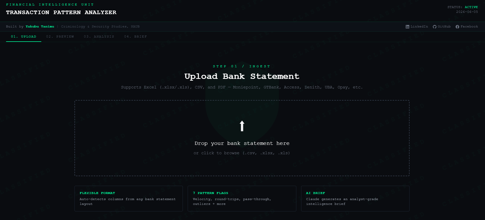
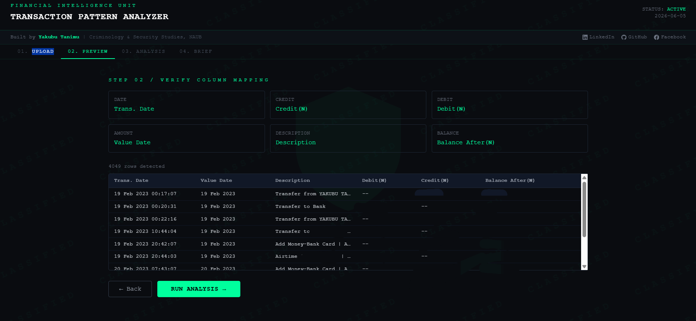
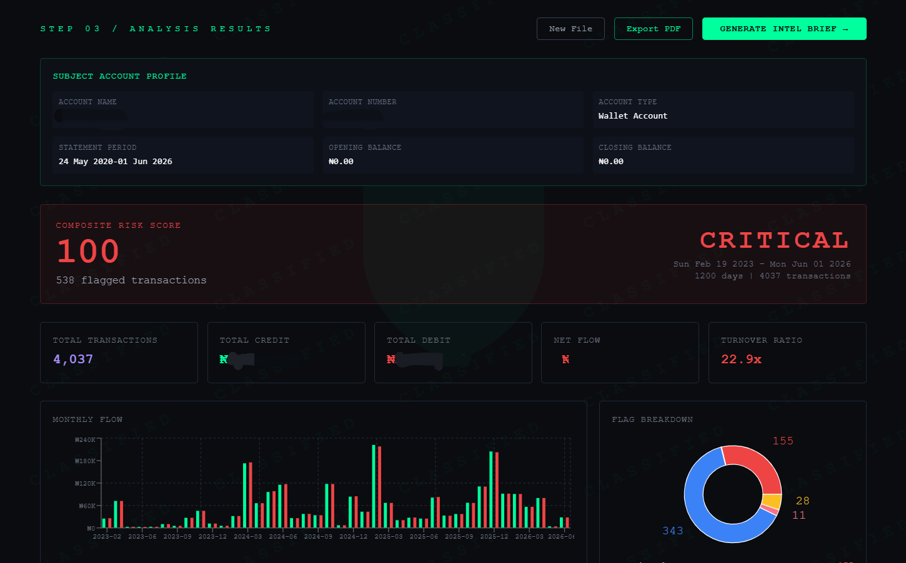
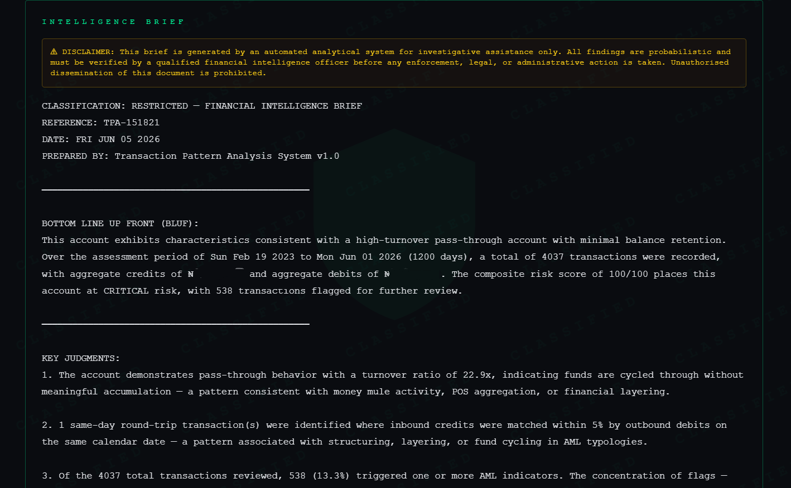

# Transaction Pattern Analyzer

> A financial intelligence tool for detecting AML indicators, suspicious transaction patterns, and counterparty risk in Nigerian bank statements.

Built by **Yakubu Tanimu** — Criminology & Security Studies, Nigerian Army University Biu (NAUB)

[](https://transaction-analyzer.vercel.app)
[](https://github.com/yakubuta)
[](https://www.linkedin.com/in/yakubu-tanimu-723a3221a)

---

## Screenshots

### 01 — Upload


### 02 — Column Mapping Preview


### 03 — Analysis Dashboard


### 04 — Intelligence Brief


---

## Overview

The **Transaction Pattern Analyzer** is a browser-based analytical tool built to assist financial intelligence officers and AML analysts in reviewing bank statement data. It ingests Nigerian bank statements in Excel or CSV format, applies rule-based pattern detection aligned with NFIU and FATF AML typologies, and generates a structured intelligence brief.

---

## Features

### Pattern Detection Flags
| Flag | Description |
|------|-------------|
| **High Velocity** | Days with 10+ transactions — potential structuring |
| **Round-Number Transfers** | Exact multiples of ₦100,000+ — pre-arranged payments |
| **Same-Day Round Trips** | Credit matched by near-equivalent debit same day — layering |
| **Pass-Through Behavior** | Turnover ratio >10x — money mule or POS aggregator activity |
| **Late-Night Transactions** | Activity between 23:00–04:00 |
| **Large Outliers** | Single transactions exceeding 5x account average |
| **Structuring** | Multiple transactions totalling near a threshold within 7 days |
| **Dormancy & Activation** | Account quiet 30+ days then reactivates with large transfers |
| **Keyword Flagging** | Narrations containing suspicious terms (crypto, gift, offshore, etc.) |
| **First-Time Large** | First-ever transaction with a counterparty above ₦100,000 |

### Intelligence Features
- **Composite Risk Score** — weighted 0–100 (Low / Medium / High / Critical)
- **Subject Account Profile** — auto-extracts account name, number, bank, BVN, branch, and statement period
- **Counterparty Network Analysis** — unique counterparties with individual risk scores, bidirectional flow detection, transaction history, and bank routing
- **Behavioral Timeline** — 24-hour radial clock + day-of-week bar chart
- **Global Search & Filter** — search all transactions by name, amount, date, narration; filter by flag type and date range
- **Intelligence Brief** — structured BLUF report with key judgments, indicators of concern, account behavior profile, and recommended actions
- **PDF Export** — dark-theme print layout with background graphics preserved

---

## Supported File Formats

| Format | Banks |
|--------|-------|
| `.xlsx` / `.xls` | Moniepoint, GTBank, Access Bank, Zenith Bank, UBA, First Bank, Opay, Palmpay |
| `.csv` | Any bank with CSV export |

---

## Tech Stack

- **React** + **Vite**
- **Tailwind CSS**
- **Recharts** — data visualization
- **SheetJS (xlsx)** — Excel parsing
- **PapaParse** — CSV parsing

---

## Getting Started

### Prerequisites
- Node.js 18+
- npm

### Installation

```bash
git clone https://github.com/yakubuta/transaction-analyzer.git
cd transaction-analyzer
npm install
npm run dev
```

Open `http://localhost:5173` in your browser.

### Build for Production

```bash
npm run build
```

---

## Usage

1. **Upload** — drag and drop your bank statement (Excel or CSV)
2. **Verify** — confirm auto-detected column mapping
3. **Analyze** — run pattern analysis
4. **Review** — examine risk score, flagged transactions, counterparty network, and behavioral timeline
5. **Brief** — generate an intelligence brief
6. **Export** — save as PDF

---

## AML Framework Alignment

This tool is designed with reference to:
- **NFIU** (Nigerian Financial Intelligence Unit) suspicious transaction reporting guidelines
- **FATF** Recommendations 20 & 21 (Reporting of suspicious transactions)
- **Money Laundering (Prevention and Prohibition) Act 2022**
- **CBN AML/CFT Regulations**

---

## Disclaimer

This tool is for analytical assistance only. All findings are probabilistic and must be verified by a qualified financial intelligence officer before any enforcement, legal, or administrative action is taken.

---

## Author

**Yakubu Tanimu**
- GitHub: [@yakubuta](https://github.com/yakubuta)
- LinkedIn: [Yakubu Tanimu](https://www.linkedin.com/in/yakubu-tanimu-723a3221a)
- Facebook: [Yakubu Tanimu](https://www.facebook.com/share/1HUk922EmY/)

---

## License

MIT License — free to use, modify, and distribute with attribution.